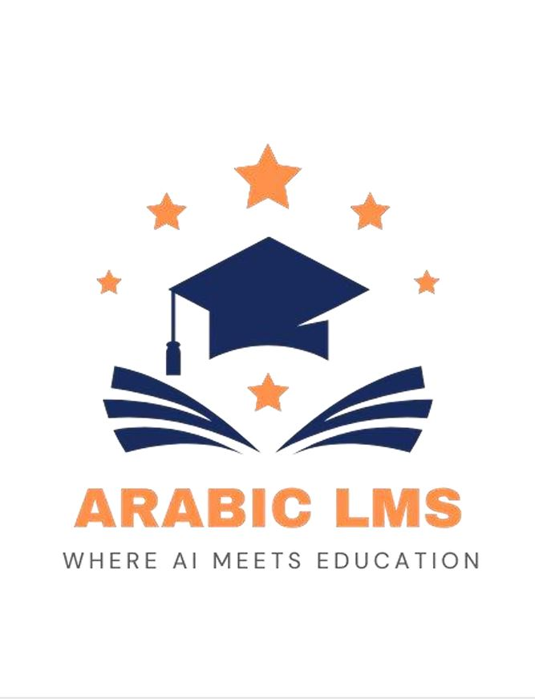
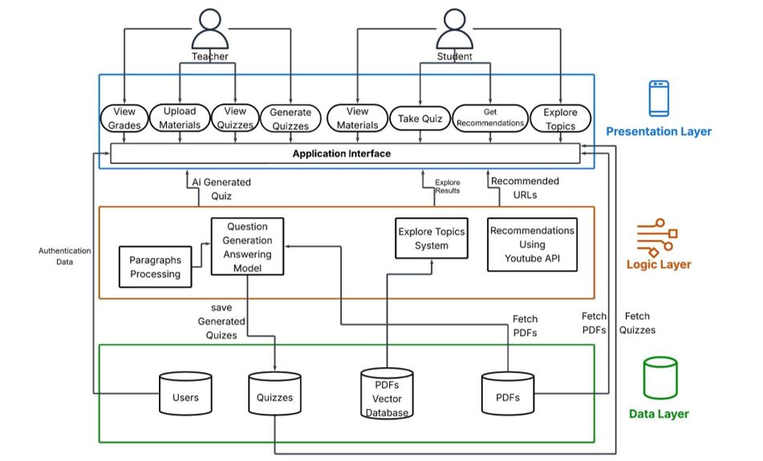
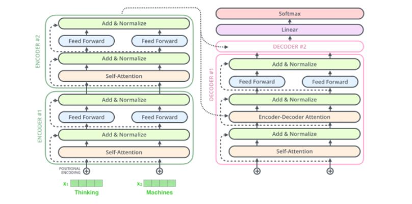
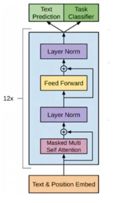

# Arabic-Learning-Management-System

An AI-powered mobile application designed to personalize Arabic-language education. The system assists teachers with automatic quiz generation, evaluates student performance, and recommends personalized resources based on student weaknesses. With deep integration of NLP, recommendation systems, and mobile technologies, ALMS enables a smarter and more adaptive educational experience.

## 📑 Table of Contents
- [Demo Video](#demo-video)  
- [Technologies Used](#technologies-used)  
- [System Architecture](#system-architecture)  
- [Models](#models)  
- [Evaluation Results](#evaluation-results)  

## Demo Video

## 🛠️ Technologies Used

**📱 Mobile App:**  
Flutter & Dart: Cross-platform mobile development

**⚙️ Backend:**  
- Python + FastAPI: RESTful API server for model endpoints  
- Google Colab / Kaggle Notebooks: Model hosting and inference

**🤖 NLP & AI:**  
- Hugging Face Transformers, PyTorch: Core NLP model infrastructure  
- AraT5, AraBART, mT5: Arabic question generation  
- YouTube API, FAISS, Sentence Transformers: Semantic search and resource ranking

## 🧩 System Architecture

**📱 Presentation Layer**

* **Mobile App (Flutter):** Interface for teachers and students to take quizzes, view progress, and receive resource recommendations.
* **Authentication:** Role-based login system for secure access.
* **Material & Progress Management:** Enables users to view course content and track performance over time.

**🧠 Logic Layer**

* **Quiz Generator:** Automatically creates Arabic MCQs using models like AraT5, AraBART, and mT5 from uploaded course PDFs.
* **Performance Tracker:** Analyzes quiz results to identify weak topics and deliver real-time feedback.
* **Resource Recommender:**

  * **Option 1:** YouTube API + Sentence Transformer for video recommendations.
  * **Option 2:** FAISS Vector DB + Arabic EKB dataset for relevant text snippets.

**🗂️ Data Layer**

* **User Database:** Stores user info, profile data, and roles.
* **Assessment Storage:** Saves quiz templates, attempts, and grades.
* **Educational Content:** Stores PDFs, YouTube links, and Q\&A data for learning and evaluation.

## 🧠 Models

### **Arabic Question Generation**

Fine-tuned **AraT5**, **AraBART**, and **mT5** on our custom EKB dataset to automatically generate Arabic MCQs.

* **AraT5** achieved the best performance across all metrics (BLEU-4, METEOR, F1, BERTScore).
* Increasing epochs and gradient accumulation improved generalization.
* **AraBART** and **mT5** performed well but consistently underperformed compared to AraT5.
* All models were evaluated using standard NLP metrics.

**T5 Architecture**:

**BART Architecture**:

### **Arabic Question Answering (QA)**

* AraT5 outperformed other models (F1: **0.8890** on Arabic-SQuAD, **0.7387** on EKB).
* It showed strong robustness with long, domain-specific answers.
* **AraBART** and **mT5** also performed acceptably but with lower F1.

### **Distractor Generation**

* **AraT5** fine-tuned on **Arabic-RACE** and **EKB** for generating plausible distractors.
* Higher scores were obtained on Arabic-RACE due to dataset quality and diversity.
* Human evaluation confirmed distractor relevance, plausibility, and distinctiveness.

### **Resource Recommendation System**

Used **Sentence Transformers** with **YouTube API** for recommending videos when a student answers incorrectly and **FAISS Vector Search** for semantic search over EKB Curriculum Dataset.
